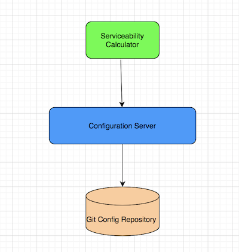

# Serviceability Calculator RESTFul API

This project is an application expose API to calculate serviceability of a given loan application.

## Getting Started

### Prerequisites
* Git
* JDK 11
* Gradle 6.0 or later
* AWS Elastic Beanstalk CLI (This application was developed on MacOS, hence used the following AWS guide to install the tool)
  [https://docs.aws.amazon.com/elasticbeanstalk/latest/dg/eb-cli3-install-osx.html]

### Clone
To get started you can simply clone this repository using git:
```
https://github.com/KalpaD/TechnicalChallenge.git
cd part-2/serviceability-cal-rest
```

### Build an executable JAR
You can run the application from the command line using:
```
./gradlew bootRun
```
Or you can build a single executable JAR file that contains all the necessary dependencies, classes, and resources with:
```
./gradlew clean build
```
Then you can run the JAR file with:
```
cd build/libs
java -jar *.jar
```

### Deploy to AWS Elastic Beanstalk

Prerequisites
Install and configure AWS Elastic Beanstalk CLI with an IAM User who has privilege to 
execute commands via eb tool.

1. Build the application locally using following command at `TechnicalChallenge/part-2/serviceability-cal-rest/`
    ```
    ./gradlew clean build
    ```    
2. Run the following eb commands to create a deployment in AWS Elastic Beanstalk
    ```
   eb init
   
   Select a default region
   1) us-east-1 : US East (N. Virginia)
   2) us-west-1 : US West (N. California)
   3) us-west-2 : US West (Oregon)
   4) eu-west-1 : EU (Ireland)
   5) eu-central-1 : EU (Frankfurt)
   6) ap-south-1 : Asia Pacific (Mumbai)
   7) ap-southeast-1 : Asia Pacific (Singapore)
   8) ap-southeast-2 : Asia Pacific (Sydney)
   9) ap-northeast-1 : Asia Pacific (Tokyo)
   10) ap-northeast-2 : Asia Pacific (Seoul)
   11) sa-east-1 : South America (Sao Paulo)
   12) cn-north-1 : China (Beijing)
   13) cn-northwest-1 : China (Ningxia)
   14) us-east-2 : US East (Ohio)
   15) ca-central-1 : Canada (Central)
   16) eu-west-2 : EU (London)
   17) eu-west-3 : EU (Paris)
   18) eu-north-1 : EU (Stockholm)
   19) eu-south-1 : EU (Milano)
   20) ap-east-1 : Asia Pacific (Hong Kong)
   21) me-south-1 : Middle East (Bahrain)
   22) af-south-1 : Africa (Cape Town)
   (default is 3): 8
   
   
   Enter Application Name
   (default is "serviceability-cal-rest"):
   Application serviceability-cal-rest has been created.
   Select a platform.
   1) .NET Core on Linux
   2) .NET on Windows Server
   3) Docker
   4) GlassFish
   5) Go
   6) Java
   7) Node.js
   8) PHP
   9) Packer
   10) Python
   11) Ruby
   12) Tomcat
   (make a selection): 6
   
   Select a platform branch.
   1) Corretto 11 running on 64bit Amazon Linux 2
   2) Corretto 8 running on 64bit Amazon Linux 2
   3) Java 8 running on 64bit Amazon Linux
   4) Java 7 running on 64bit Amazon Linux
   (default is 1): 1
   
   Cannot setup CodeCommit because there is no Source Control setup, continuing with initialization
   Do you want to set up SSH for your instances?
   (Y/n): n
   ```
 3. At this point eb tool will create a config.yml file at `.elasticbeanstalk/config.yml` which should have the following configurations
    ```
    branch-defaults:
      default:
        environment: null
        group_suffix: null
    global:
      application_name: serviceability-cal-rest
      branch: null
      default_ec2_keyname: null
      default_platform: Corretto 11 running on 64bit Amazon Linux 2
      default_region: ap-southeast-2
      include_git_submodules: true
      instance_profile: null
      platform_name: null
      platform_version: null
      profile: eb-cli
      repository: null
      sc: null
      workspace_type: Application

    ```
    Please add the deployment element which point the `deploya.rtifact`
    ```
    branch-defaults:
      default:
        environment: serviceability-cal-rest-dev
        group_suffix: null
    deploy:
      artifact: build/libs/serviceability-cal-rest-1.0.1.jar
    global:
      application_name: serviceability-cal-rest
      branch: null
      default_ec2_keyname: null
      default_platform: Corretto 11 running on 64bit Amazon Linux 2
      default_region: ap-southeast-2
      include_git_submodules: true
      instance_profile: null
      platform_name: null
      platform_version: null
      profile: eb-cli
      repository: null
      sc: null
      workspace_type: Application

    ```
 4. Start the deployment of the application by 
   ```
   eb crease -s

   Enter Environment Name
      (default is serviceability-cal-rest-dev):
      Enter DNS CNAME prefix
      (default is serviceability-cal-rest-dev): serviceability-cal

   Enter Environment Name
   (default is serviceability-cal-rest-dev):
   Enter DNS CNAME prefix
   (default is serviceability-cal-rest-dev): serviceability-cal
   
   Would you like to enable Spot Fleet requests for this environment? (y/N): n
   Uploading: [##################################################] 100% Done...
   Environment details for: serviceability-cal-rest-dev
     Application name: serviceability-cal-rest
     Region: ap-southeast-2
     Deployed Version: app-210321_075923
     Environment ID: e-ghvgasr6bk
     Platform: arn:aws:elasticbeanstalk:ap-southeast-2::platform/Corretto 11 running on 64bit Amazon Linux 2/3.1.6
     Tier: WebServer-Standard-1.0
     CNAME: serviceability-cal.ap-southeast-2.elasticbeanstalk.com
     Updated: 2021-03-20 20:59:33.884000+00:00
   Printing Status:
   2021-03-20 20:59:33    INFO    createEnvironment is starting.
   2021-03-20 20:59:34    INFO    Using elasticbeanstalk-ap-southeast-2-028383914922 as Amazon S3 storage bucket for environment data.
   2021-03-20 20:59:55    INFO    Created security group named: awseb-e-ghvgasr6bk-stack-AWSEBSecurityGroup-UMGEJGECEUNL
   2021-03-20 21:00:10    INFO    Created EIP: 13.239.157.130
   2021-03-20 21:01:17    INFO    Waiting for EC2 instances to launch. This may take a few minutes.
   2021-03-20 21:01:23    INFO    Instance deployment successfully detected a JAR file in your source bundle.
   2021-03-20 21:01:23    INFO    Instance deployment successfully generated a 'Procfile'.
   2021-03-20 21:01:26    INFO    Instance deployment completed successfully.
   2021-03-20 21:01:59    INFO    Application available at serviceability-cal.ap-southeast-2.elasticbeanstalk.com.
   2021-03-20 21:01:59    INFO    Successfully launched environment: serviceability-cal-rest-dev
   ```
  
3. Now you should be able to access the serviceability api at the following endpoint
   ```
   curl --location --request POST 'http://serviceability-cal.ap-southeast-2.elasticbeanstalk.com:80/api/serviceability/calculate' \
   --header 'Content-Type: application/json' \
   --data-raw '{
     "incomes": [
       {
         "description": "salary",
         "frequency": "M",
         "value": 1000.00
       },
       {
         "description": "rental income",
         "frequency": "M",
         "value": 400.00
       }
     ],
     "expenses": [
       {
         "description": "mortgage",
         "frequency": "M",
         "value": 200.00
       },
       {
         "description": "entertainment",
         "frequency": "M",
         "value": 13.00
       }
     ]
   }'
   ```
   
### Assumptions

##### At the moment this method assumes there are only two frequencies for income and expenses.

#### Answers to the additional questions.

1. How would you “version” your service, so if the FACTOR or whole of the calculation changes you can replicate past results?

   Answer : At the moment `build.gradle` file contains the version of the application.

   ```
    group = 'com.kds.serviceabilitycal'
    version = '1.0.1'
   

   It follows the semantic visioning strategy.
   However, if we are going to deploy this application to the production environment, there are few more aspects of versioning.
    
   For predictable deployment agnostic to the environment: We can containerized the application and tag it with the container application version and commit hash.
    
   For consumer transparency of the API: I have introduced the path-based version to the API.  
    
   If we have the correct version of the docker image, replicate past results is just a matter of deploying the correct image.
    
   ```
2. How could you allow an internal party (external to Engineering) manage the FACTOR and calculation? Being able to transform or evolve it
   as needed?
   
   ```
    A typical external config server setup looks like the above.
    
    There are plenty of standard solutions for this in different frameworks and platforms.
    Since we already have SpringBoot in this project, I would configure Spring Cloud Config Server, backed by a Git repository as shown in the above picture.
    
    Then we can expose an endpoint to the external party (with proper authorization and audit log) to update the
    git repository when they want to update the FACTOR.

  
   ```
3. Please describe how would you deal with authorisation? E.g. how can you guarantee only “approved” consumers can access your service?
   ```
   It depends on the use of this endpoint/service.
   
   1. If this service only expose to other services in the same network boundary, we can use 
      basic auth with generic account set up with audit information, for example, use Cyber Arc Vault.
   
   2. If this endpoint exposed to the public internet, then we can use Oauth 2.0 access_token with a properly defined scope (craft for the level of authorization required)
      For example, we can use API manager product to proxy this endpoint, and only after validating the access_token
      users will be able to invoke this endpoint.
   
   3. If we do not want a heavy weight API manager, then we can delegate authorization to third-party
      identity and access management services like Okta or OAuth0 , Pind identity.
      They manage the access_token management and introspective endpoints. 
      This endpoint asks them the question, is this request authorized to have access to invoke me?
   ```
